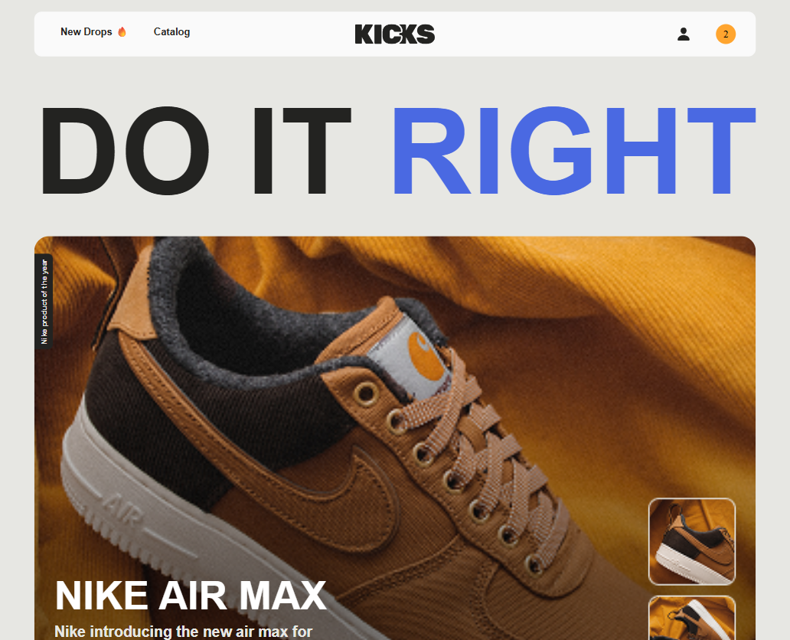
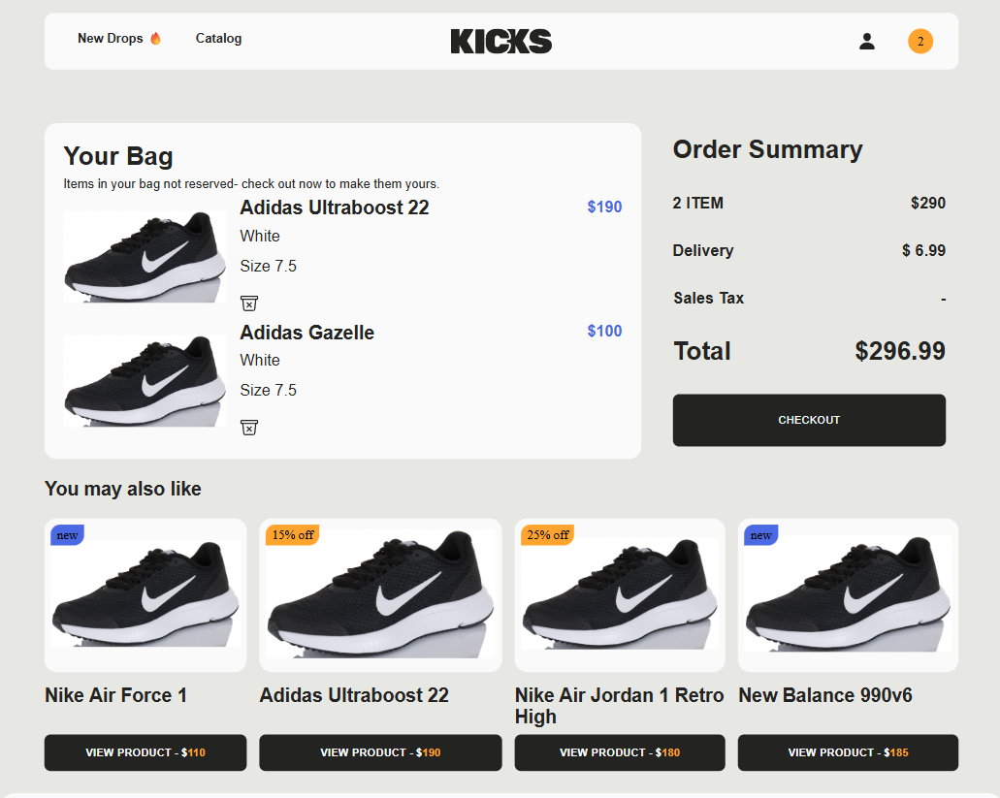
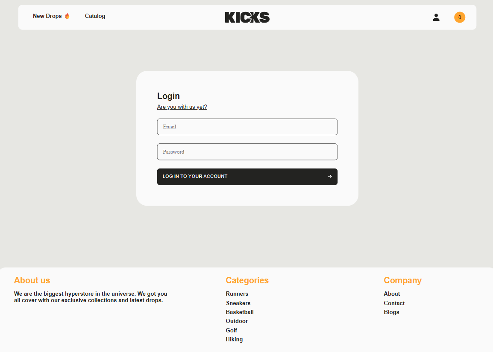
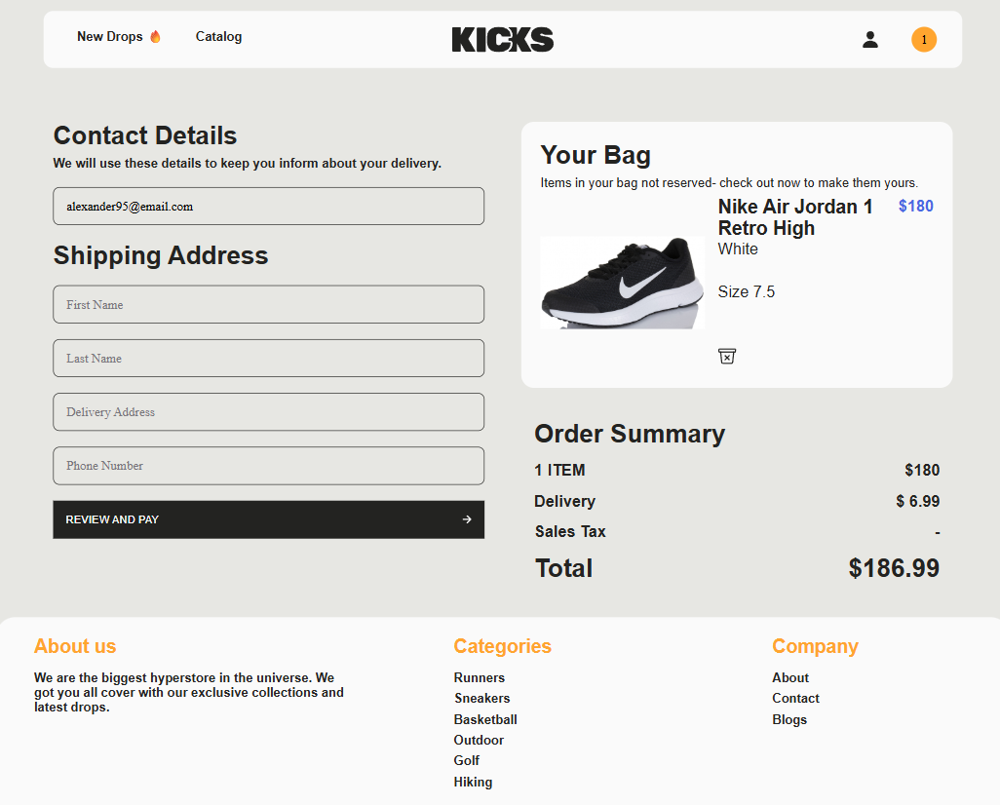

# 👟 KICKS — интернет-магазин кроссовок

**🔗 Демо:** [https://katniss-kk.github.io/Kicks/#/](https://katniss-kk.github.io/Kicks/#/)

[](https://reactjs.org/)
[](https://www.typescriptlang.org/)
[](https://redux.js.org/)
[](https://vitejs.dev/)
[](https://storybook.js.org/)

## 📸 Скриншоты

| Главная | Каталог | Карточка товара | Корзина |
|---------|---------|------------------|---------|
|  |  |  |  |

| Авторизация | Регистрация | Оформление заказа | Мобильная версия |
|-------------|-------------|--------------------|-------------------|
|  |  |  |  |


**KICKS** — это полноценный интернет-магазин кроссовок с корзиной, фильтрацией и авторизацией. Проект разработан на чистом фронтенде с имитацией бэкенда через LocalStorage.

---

## ✨ Функциональность

- ✅ **Авторизация и регистрация** пользователей (данные хранятся в LocalStorage)
- ✅ **Каталог товаров** с пагинацией (React Paginate)
- ✅ **Фильтрация** по брендам, размерам и категориям
- ✅ **Детальная страница** каждого товара с галереей (Swiper)
- ✅ **Корзина** с добавлением/удалением товаров
- ✅ **Оформление заказа** с формой доставки
- ✅ **Адаптивная верстка** от 390px до 1440px
- ✅ **Сохранение состояния** корзины и авторизации в LocalStorage
- ✅ **Storybook** для изоляции и тестирования UI-компонентов

---

## 🛠 Стек технологий

| Категория | Технологии |
|-----------|------------|
| **Язык** | TypeScript 5.9.3 |
| **Фреймворк** | React 19.2.0 |
| **Сборщик** | Vite 7.2.4 |
| **Роутинг** | React Router 5.3.3 |
| **Стейт-менеджмент** | Redux 2.11.2 |
| **Стилизация** | CLSX 2.1.1 (CSS-модули) |
| **UI-кит** | StoryBook 10.2.3 |
| **Слайдер** | Swiper 12.1.10 |
| **Пагинация** | React Paginate 8.2.0 |
| **Линтер** | ESLint 3.39.2 |
| **Форматтер** | Prettier 3.8.1 |

---


## 🚀 Установка и запуск


``` bash
# Клонировать репозиторий
git clone https://github.com/katniss-kk/Kicks.git

# Перейти в папку проекта
cd Kicks

# Установить зависимости
npm install

# Запустить проект
npm run dev
```

## 📂 Структура проекта

src/
├── api/ # API запросы
├── app/ # Инициализация приложения
├── assets/ # Картинки, шрифты, иконки
├── entities/ # Бизнес-сущности (product, user, cart)
├── features/ # Функциональные модули (auth, filters, order)
├── layout/ # Хедер, футер, обертки
├── libs/ # Хелперы, константы, хуки
├── pages/ # Страницы
├── services/ # Redux store, слайсы
├── shared/ # Переиспользуемые UI-компоненты
├── stories/ # Storybook истории
├── types/ # TypeScript типы
└── widgets/ # Самостоятельные блоки (карточки, фильтры)

## 🔮 Планы по доработке

- [ ] **Поиск** — добавить поиск по товарам
- [ ] **Тесты** — написать unit-тесты (Jest)
- [ ] **Запросы** — переписать получения данных на TaskQuery